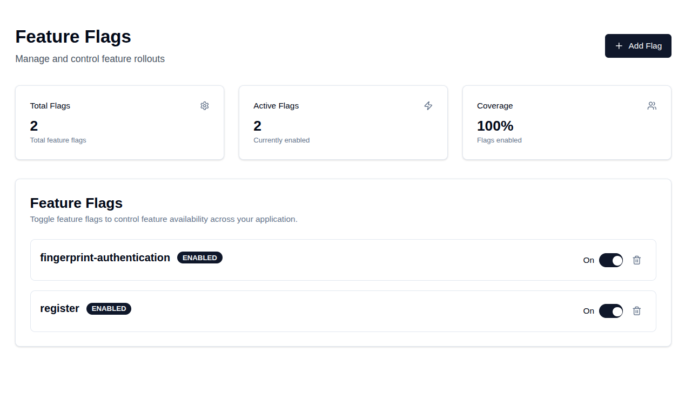

# Fiber Feature Flag

A simple, pluggable feature flag system for Go web applications using [Fiber](https://gofiber.io/). Supports both file-based and Redis-based storage backends.

## Features

- Toggle feature flags at runtime via a web UI or API
- Pluggable storage: JSON file or Redis
- Thread-safe and production-ready
- RESTful API for integration with your frontend or CI/CD

## Installation

```sh
go get github.com/miqdadyyy/fiber-featureflag
```

## Usage

### 1. File-based Feature Flag Provider

```go
import (
    "github.com/gofiber/fiber/v2"
    "github.com/miqdadyyy/fiber-featureflag/featureflag"
    "github.com/miqdadyyy/fiber-featureflag/providers"
)

func main() {
    app := fiber.New()

    fff := featureflag.NewFiberFeatureFlag(
        providers.NewFileProvider(
            providers.FileProviderOptions{Path: "storage/fff.json"},
        ),
    )
    app.Use("/fff", fff.GetHandler)

    app.Listen(":3000")
}
```

> **Note:**  
> Make sure the `storage/` directory exists and is writable by your application.

### 2. Redis-based Feature Flag Provider

```go
import (
    "github.com/gofiber/fiber/v2"
    "github.com/miqdadyyy/fiber-featureflag/featureflag"
    "github.com/miqdadyyy/fiber-featureflag/providers"
)

func main() {
    app := fiber.New()

    fff := featureflag.NewFiberFeatureFlag(
        providers.NewRedisProvider(
            providers.RedisProviderOptions{
                Addr:   "redis://localhost:6379/0",
                Prefix: "fff:",
            },
        ),
    )
    app.Use("/fff", fff.GetHandler)

    app.Listen(":3000")
}
```

## Programmatic Usage

You can also use the feature flag system programmatically in your Go code:

```go
import (
    "context"
    "fmt"
    "github.com/miqdadyyy/fiber-featureflag/featureflag"
    "github.com/miqdadyyy/fiber-featureflag/providers"
)

fff := featureflag.NewFiberFeatureFlag(
    providers.NewFileProvider(
        providers.FileProviderOptions{Path: "storage/fff.json"},
    ),
)

// Example of get feature flag status
if fff.GetFeatureFlagStatus(context.Background(), "test") {
    fmt.Println("Hey feature flag is enabled")
}

// Example of enabling a feature flag
if err := fff.EnableFeatureFlag(context.Background(), "test"); err != nil {
    fmt.Println("Failed to enable feature flag", err)
} else {
    fmt.Println("Feature flag enabled successfully")
}

// Example of disabling a feature flag
if err := fff.DisableFeatureFlag(context.Background(), "test"); err != nil {
    fmt.Println("Failed to disable feature flag", err)
} else {
    fmt.Println("Feature flag disabled successfully")
}
```

## API Endpoints

All endpoints are under the path you mount (e.g., `/fff`).

- `GET    /fff`  
  Returns all feature flags as JSON.

- `GET    /fff?key=flag-name`  
  Returns the status of a specific flag.

- `POST   /fff`  
  Create a flag.  
  **Body:** `{ "key": "flag-name" }`

- `DELETE /fff`  
  Disable a flag.  
  **Body:** `{ "key": "flag-name" }`

- `PATCH  /fff`  
  Toggle a flag.  
  **Body:** `{ "key": "flag-name" }`

## Web UI

Visit `/fff` in your browser for a simple management UI.


